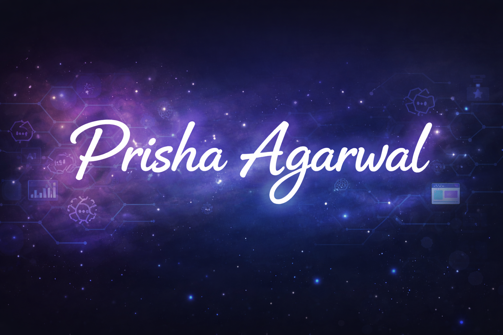

  

# 💫 About Me:
Hey there! 👋 I’m Prisha (@prisha90)
 
🎓 B.E. (Hons.) Computer Science
🤖 Exploring the intersection of AI, Machine Learning, and Full-Stack Development

I’m someone who enjoys learning by building. What started as a reluctance towards coding slowly turned into genuine curiosity and now, into a habit of shipping projects 🚀. From web apps to deep learning pipelines, I like working on ideas that are both technically challenging and practically useful.

⚡ Fun fact: I didn’t like coding initially but projects changed everything.

# What I’m Working On

🧠 Computer Vision & Medical Imaging

🤝 Trust & Fairness in AI

🌐 Web, App & Full-Stack Projects

📚 Academic + Applied CS

# What You’ll Find on My GitHub

📁 End-to-end ML projects (data → model → evaluation)

🌍 Full-stack applications with real-world use cases

🧪 Experimental repos where I test ideas & architectures

📖 Academic + course-related implementations

I believe in writing readable code, understanding what I build and continuously improving 'one repo at a time'.

## 🌐 Socials:
  

# 💻 Tech Stack:
                                           
# 📊 GitHub Stats:
 
 

### ✍️ Random Dev Quote

<!---
prisha90/prisha90 is a ✨ special ✨ repository because its `README.md` (this file) appears on your GitHub profile.
You can click the Preview link to take a look at your changes.
--->
